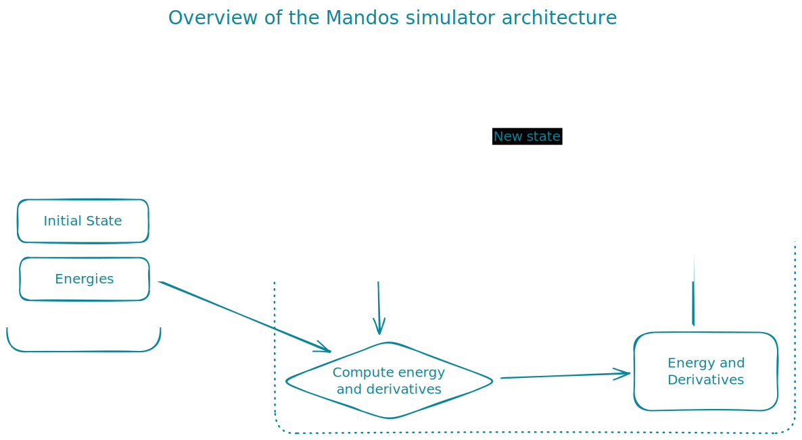

# Mandos
General purpose simulator for c++ and python.

## Build

This project is built using `CMake` and should work on Windows and Linux. To build the project one needs to have `git`. `cmake`, and a c++ compiler installed. To clone the repository and build it run the following commands:
```sh
git clone --recursive https://github.com/MagiRomanya/Mandos.git
cd Mandos
mkdir build
cd build
cmake ..
cmake --build .
```

## Project architecture

